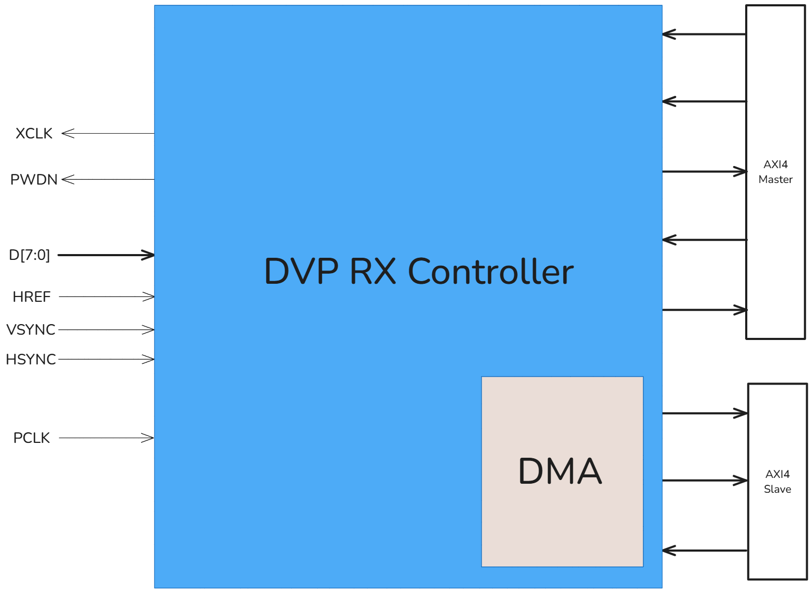

# DVP RX Controller

*Design note of DVP RX Controller IP*

# 1. Specification

## 1.1. Introduction

DVP RX Controller is a module used to communicate between the on-chip system and external camera sensors using the **DVP (Digital Video Port) protocol**. The controller is divided into 2 layers.

- **Physical Layer**: This layer implements the **DVP protocol** to handle communication with the connected camera sensor
- **Application Layer**: This layer uses the **AXI4 protocol** and includes an internal DMA (Direct Memory Access) to efficiently transfer pixel data from the DVP interface to the system's memory.

Additionally, we provide 2 ways to configure the IP:

- **Hard-configuration**: configure via parameters of the RTL code (for downscale, gray-scale, etc.)
- **Soft-configuration**: configure via a separate AXI4 Slave interface for configuration purposes (for start-signal, clock prescaler, downscale methods, the destination address of DMA, etc.)

### 1.2. Interface

*The DVP RX Controller has 3 main interfaces: DVP interface, AXI4 (Slave) interface, AXI4 (Master) interface.*

### 1.3. Block diagram

# 2. Soft-configuration

The AXI4 Master writes configuration values to the IP’s AXI4 (slave) interface via AXI4 protocol. This interface supports 1 outstanding single-burst transaction and DECERR response.

The DVP RX controller IP has **3 configuration registers**

- `DVP_STATUS_REG` (*with base address `0x4000_0000` or user can reconfigure via parameter `IP_CONF_BASE_ADDR`*)
    
    
    | Bit’s index | Description |
    | --- | --- |
    | 0 | Start signal for DVP capturing and DMA working |
    | 1-31 | Reserved |
- `SCALER_CONF_REG` (*with base address `0x4000_0004` or user can reconfigure via parameter `IP_CONF_BASE_ADDR`*)
    
    
    | Bit’s index | Description |
    | --- | --- |
    | 0-31 | Reserved |
- `PXL_MEM_BASE_REG` (*with base address `0x4000_0008` or user can reconfigure via parameter `IP_CONF_BASE_ADDR`*)
    
    
    | Bit’s index | Description |
    | --- | --- |
    | 0-31 | The destination address to which the DMA moves all pixels |

# 3. Behavior

## 3.1. Soft-configuration behavior

- 1st step: the Master will generate 1 AW transfer with 1 desired address
    
    
    
- 2nd step: the Master will generate 1 W transfer with 1 desired data
    
    
    
- 3rd step: the Master should check the response from the IP
    
    
    

## 3.2. DMA Working behavior

- The DMA will start a write transaction upon receiving 1 pixel with the configured address (`PXL_MEM_BASE_REG`)
    
    
    
- The DMA will write data until one frame is completed, at which point the transaction will be terminated via the WLAST signal
    
    
    
    
    

## 3.3. DVP protocol behavior

*More detail in this datasheet: [OV7670_DS (1.01).fm](https://www.voti.nl/docs/OV7670.pdf)*